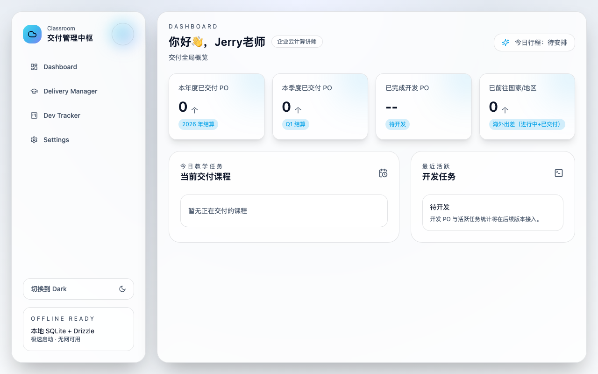
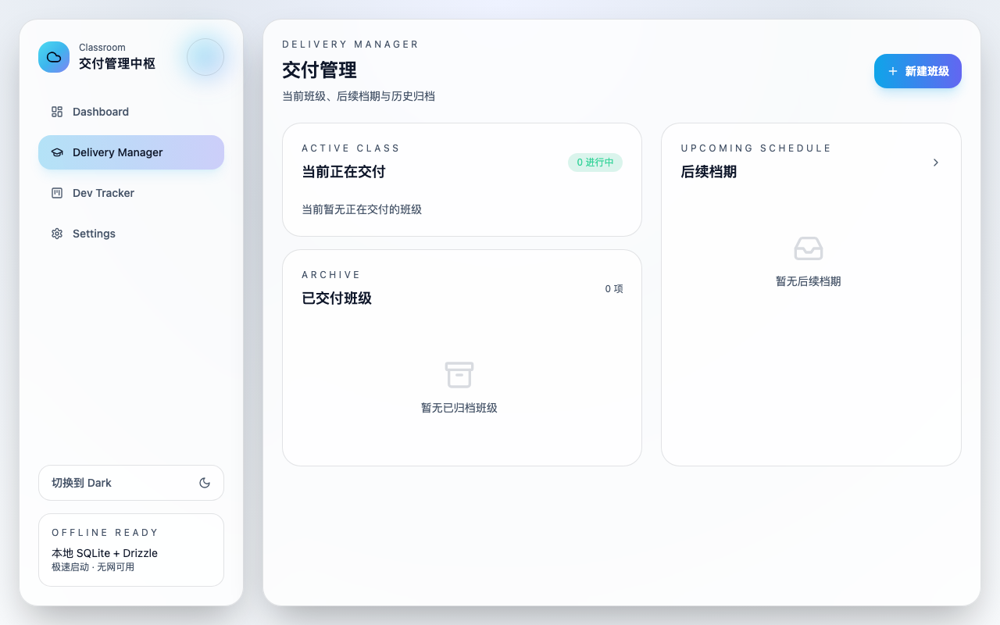
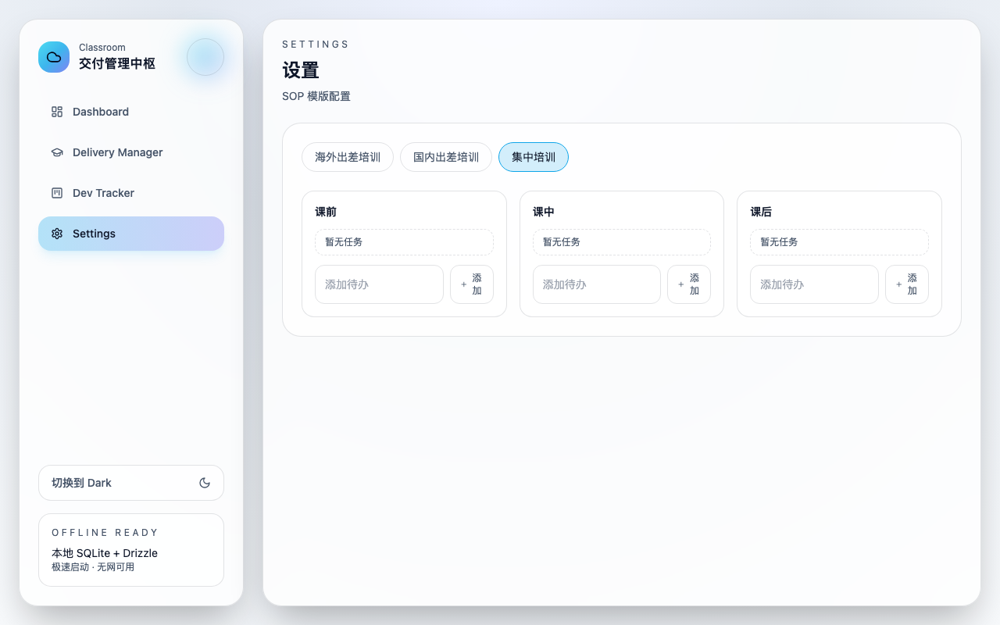

# Classroom

> Offline-first desktop workspace for delivery-focused trainers.
> 面向讲师与交付管理的本地优先桌面工作台。

Classroom 聚焦「培训交付」主线，把班级生命周期管理、SOP 执行、课程安排、讲师复盘和数据概览集中到一个本地应用中，减少手工跟进与信息分散。



## Highlights
- Offline-first: 核心数据保存在本地 SQLite，无网可用。
- Delivery-centric: 围绕班级从排期、进行中到归档的完整流转。
- SOP-driven: 支持按班级类型配置 SOP 模版并自动生成任务。
- Lightweight operations: 一线讲师可快速录入课程、复盘记录、进度更新。
- Desktop experience: 基于 Tauri，启动快、资源占用低。

## Core Features
- Dashboard
- 年度/季度交付 PO 数据汇总（基于已完成班级结算）
- 当日行程与当前交付课程总览
- 海外交付国家/地区覆盖统计

- Delivery Manager
- 班级状态流转：Upcoming -> Active -> Completed
- 多班级并行交付展示
- 一键开始/完结交付（含确认弹框）
- 自动归档：SOP 达到 100% 后自动标记归档并提示



- Class Detail
- 班级基础信息、PO 结构（授课 PO / 班主任 PO / 总 PO）
- SOP 任务清单与阶段进度
- 交付课程管理（新增/删除）
- 讲师复盘快速记录板（自动保存）

- Settings
- SOP 模版配置（按班级类型 + 训前/训中/训后）
- 支持添加、删除、上下移动排序
- 模版实时落库，后续新建班级自动套用



## Tech Stack
- Tauri v2
- React 18 + Vite
- TypeScript
- Tailwind CSS + Framer Motion
- SQLite (via `@tauri-apps/plugin-sql`)

## Project Structure
```text
src/
  components/        UI components
  db/                data access & schema helpers
  pages/             feature pages (Dashboard, Delivery, Settings...)
src-tauri/
  src/               Rust entry
  migrations/        SQL migrations
  icons/             app icons (icns/ico/png/android/ios)
```

## Quick Start

### 1) Install
```bash
npm install
```

### 2) Run Web (UI only)
```bash
npm run dev
```

### 3) Run Desktop (Tauri)
```bash
npm run tauri:dev
```

### 4) Build
```bash
npm run build
npm run tauri:build
```

## Data & Storage
- Local DB file: `src-tauri/classroom.db`
- No cloud dependency by default
- 数据以本地文件形式持久化，请自行做好备份策略

## Roadmap
- Dev Tracker 完整功能（开发 PO、任务看板、统计）
- 更细粒度的权限/角色划分
- 交付报表导出（阶段、班级、讲师维度）
- 自动化提醒与日历集成

## Version
- Current release: `v0.0.1`

## Production Release
- Signed release workflow: `.github/workflows/release-binaries.yml`
- Setup guide (macOS notarization + Windows signing): `docs/release-signing.md`

## License
If this project is intended for open-source release, add a `LICENSE` file (MIT/Apache-2.0 recommended).
